# 1. Projektdokumentation des TotalPETViewers

## 1.1 Projektinformationen

Dieses Projekt wurde im Rahmen des Moduls **Klinisches Anwendungsprojekt** der Technischen Universität München geschaffen. Dieses wurde von mir (Valentin Linhardt) eigenständig geplant, entwickelt und installiert, und ist auf [GitHub](https://github.com/VlntnLnhrdt/TotalPETView) frei verfügbar. Sollte das Projekt hier nicht mehr abrufbar sein, ist das Projekt zudem auf meiner persönlichen Webseite [vlntn.de](https://vlntn.de) gelistet, oder zumindest sind dort mögliche Kontaktdaten einsehbar.

## 1.2 Projektbeschreibung

Der TotalPETViewer ist ein web-basiertes System zur Verwaltung und Visualisierung von medizinischen Bilddaten im in der Medizin üblichen DICOM-Format. Es ermöglich den Upload, Verwaltung, Suche und die Anzeige von medizinischen Bilddatenen über eine benutzerfreundliche Weboberfläche. Angelehnt an die ursprünglich angedachte integration des Total Segmentator's und den PET-Viewer. Im Rahmen des Projektes wird die Anwendung mit TPV abekürzt.

## 1.3 Projektziel

Ziel des Projekts ist die Entwicklung eines webbasierten DICOM-Viewers zur Darstellung von bis zu vier sequenziellen PET/CT-Scans. Zudem soll eine DICOM-Schnittstelle geschaffen werden, die eine standardisierte Anbindung an externe Systeme ermöglicht. Ursprünglich sollte auch der Total Segmentator zur Organsegmentierung integriert werden, jedoch war dies aus zeittechnischen Gründen nicht möglich.

<div style="page-break-after: always;"></div>

# 2. Anforderungen

Nachfolgend sind die Anforderungen aufgelistet, welche vor Projektbeginn gestellt wurden, als auch im Laufe der Entwicklung hinzukamen.

## 2.1 Funktionale Anforderungen

- [X] Upload von DICOM-Dateien
- [X] Anzeige und Suche von Patienten in einem PACS
- [X] Zugriffskontrolle durch Loginmöglichkeit
- [X] Schaffen einer standardisierten Schnittstelle 
- [ ] Visualisierung von DICOM Dateien im Viewer mit entsprechenden Werkzeugen

## 2.2 Nicht-funktionale Anforderungen

- [X] Performance: Schnelle Ladezeiten für Bilder und Suchergebnisse
- [ ] Sicherheit: Sicher Authentifizierung und verschlüsselte Datenübertragung (letzteres nur durch Systemadministratoren möglich)
- [X] Erweiterbarkeit: Modulare Architektur zur einfache Integration neuer Funktionen

## 2.3 Technische Anforderungen

  - [X] Frontend: React, **Vue.js** oder Angular für eine performante und interaktive UI.
  - [X] Backend: Python (**Django** oder Flask), Node.js oder eine vergleichbare serverseitige Lösung.
  - [ ] DICOM-Verarbeitung: Verwendung von Libraries wie Cornerstone.js, DICOMweb, pydicom oder OHIF Viewer.
  - [X] Datenbank: Speicherung der DICOM-Daten in einer PACS-kompatiblen Lösung wie **Orthanc** oder DCM4CHEE.
  - [ ] TotalSegmentator: Einbindung über eine Python-Backend-Pipeline mit TensorFlow oder PyTorch.
  - [X] Hosting: Lokale oder **cloudbasierte Bereitstellung** (z. B. AWS, Azure, oder On-Premises-Server).


## 2.3 Gründe für unerfüllte Anforderungen

Aufgrund der fehlenden Praxis-Erfahrung mit Django, PACS im Allgemeinen sowie Vuejs, musste ich mehrere Entwicklungsansätze nach zeitintensiver Arbeit wieder verwerfen und größtenteils von Null anfangen. Hierdurch hatte ich gegen Ende der Projektphase zu wenig Zeit meine Implementierungsprobleme mit der Library Cornerstone, welche die Basis für die Darstellung von medizinischen Bildern ist, zu lösen. Daher habe ich mich darauf konzentriert, alles Andere fertig zu bekommen und ordentlich zu implementieren, damit ein möglicher Nachfolger von mir, sich vollständig auf den tatsächlichen Viewer konzentrieren kann.

<div style="page-break-after: always;"></div>

# 3. Architektur

Nachfolgend wir die gesamte Architektur des Projektes beschrieben, um einen detaillierten Überblick über die Struktur zu schaffen. Die einzelnen Komponenten wurden mittels Docker Containern implementiert und über eine gemeinsame Docker-Compose Datei gestartet, um eine systemunabhängige Ausführung zu ermöglichen.

## 3.1 Übersicht

Der TPV besteht aus drei großen Komponenten: Dem PACS, Django Backend, Vuejs Frontend.

Zur Speicherung und Verwaltung der medizinischen Daten wird als PACS "Orthanc" verwendet. Orthanc ist ein kostenloser, open-source leichtgewichtiger DICOM-Server. Auf diesem werden die DICOM Dateien gespeichert, verwaltet und abgerufen.

Für die Weboberfläche wird Vuejs verwendet, ein clientseitiges JavaScript-Webframework zur Erstellung von dynamischen Webanwendungen. Hierüber wird der Anwender ausschließlich mit dem TPV interagieren, ohne direkt auf Orthanc zuzugreifen.

Als Zwischenglied und Backend zwischen diesen beiden Services wird Django, ein high-level Python web framework, eingesetzt. Django kann auch zur Darstellung vom Webseiten genutzt werden, wird im Rahmen dieses Projektes aber als reine Schnittstelle zwischen dem Frontend und Orthanc verwendet, sowie zur Benutzerverwaltung.



<div style="page-break-after: always;"></div>

## 3.2 Orthanc

Orthanc ist ein leichtgewichtiger, open-source DICOM-Server, der für die Speicherung, Verwaltung und den Abruf von medizinischen Bilddaten im DICOM-Format konzipiert ist. Das Projekt wurde ursprünglich von dem belgischen Informatiker Sébastien Jodogne ins Leben gerufen.

Im TPV-Projekt wird Orthanc als zentrales Bildarchive (PACS) eingesetzt. Es läuft in einem eigenen Docker-Container und ist über eine REST-API ansprechbar. Das Django-Backend kommuniziert mit Orthanc, um DICOM-Dateien hochzuladen, zu suchen und abzurufen. Die Hauptabfragen, die vom Backend an Orthanc gesendet werden, sind:

* **Upload:** `POST /instances` - Sendet eine neue DICOM-Datei zur Speicherung an den Server
* **Suche:** `POST /tools/find` - Führt eine Patientensuche durch, abhängig von der Sucheingabe des Anwenders
* **Abruf:** `GET /studies/{id}` - Ruft detaillierte Metadaten zu einer spezifischen Studie ab, inklusive der zugehörigen Bildserien. 

## 3.3 Vuejs

Vue.js ist ein progressives JavaScript-Framework zur Erstellung von Benutzeroberflächen und Single-Page-Applications (SPAs). Es wurde von Evan You, einem ehemaligen Google-Mitarbeiter, entwickelt.

In diesem Projekt bildet Vue.js das gesamte Frontend. Es ist verantwortlich für die Darstellung aller Seiten, mit denen der Benutzer interagiert. Die Kommunikation mit dem Backend erfolgt asynchron über API-Aufrufe (mittels `axios`). Die Anwendung ist in mehrere Komponenten und Ansichten unterteilt, um eine klare Struktur zu gewährleisten. Die wichtigsten abrufbaren Seiten sind:

* **Login (`Login.vue`):** Der Einstiegspunkt der Anwendung zur Benutzerauthentifizierung.
* **Suche (`Suche.vue`):** Ermöglicht die Suche nach Patienten und deren Studien im PACS und zeigt entsprechende Previews das Bilddaten.
* **Upload (`Upload.vue`):** Stellt eine Oberfläche zum Hochladen von `.dcm`-Dateien bereit, diese werden im PACS gespeichert.
* **Viewer (`Viewer.vue`):** Zeigt die Metadaten einer ausgewählten Studie an und ist für die zukünftige Integration eines DICOM-Bildbetrachtes (z.B. mit Cornerstone.js) vorbereitet.
* **Benutzerverwaltung (`UserManagement.vue`):** Ermöglicht Administratoren das Anzeigen aller registrierten Benutzer und das Anlegen neuer Benutzerkonten.

<div style="page-break-after: always;"></div>

## 3.4 Django

Django ist ein High-Level-Webframework für Python, das eine schnelle Entwicklung von sicheren und wartbaren Websites ermöglicht. Das Framework wurde ursprünglich von Adrian Holovaty und Simon Willison entwickelt, als diese für eine Zeitungsredaktion arbeiteten.

Im TPV-Projekt dient Django als reines Backend und stellt eine REST-API als Schnittstelle zwischen dem Vue.js-Frontend (dem Anwender) und dem Orthanc-PACS bereit. Es übernimmt die Geschäftslogik, die Benutzerauthentifizierung und leitet Anfragen sicher an den Orthanc-Server weiter, ohne, dass das Frontend direkten Zugriff auf das PACS benötigt. 

Die wichtigsten API-Endpunkte, die das Backend bereitstellt, sind:

**Authentifizierung (`/auth/`):**
* `POST /auth/register`: Registriert einen neuen Benutzer, wird nur von einem Adiminstrator aufgerufen.
* `POST /auth/login`: Meldet einen Benutzer an.
* `POST /auth/logout`: Meldet den aktuelle Benutzer ab.
* `GET /auth/user`: Ruft die Daten des aktuell angemeldeten Benutzers ab.
* `GET /auth/users`: Ruft eine Liste aller Benutzer ab (nur für Administratoren).
* `GET /auth/set-csrf-token`: Setzt einen CSRF-Token für die aktuelle Sitzung.

**API (`/api/`):**
* `POST /api/upload`: Lädt eine oder mehrere DICOM-Dateien hoch.
* `GET /api/patient/search`: Sucht nach Patienten im PACS.
* `GET /api/patient/<id>`: Ruft spezifische Patientendaten ab.
* `GET /api/patient/<id>/studies`: Listet alle Studien des spezifizierten Patienten auf.
* `GET /api/patient/<id>/series`: Listet alle Serien des spezifizierten Patienten auf.
* `GET /api/study/<id>/series`: Listet alle Serien für die spezifizierte Studie auf.
* `GET /api/instance/<id>/preview`: Ruft ein Vorschaubild für eine DICOM-Instanz ab.
* `GET /api/instance/<id>/file`: Ruft die rohe DICOM-Datei ab.

<div style="page-break-after: always;"></div>

# 4. Installation

In diesem Kapitel wird beschrieben, wie die TotalPETView-Anwendung auf einem lokalen System in Betrieb genommen werden kann.

## 4.1 Voraussetzungen

Die gesamte Anwendung ist containerisiert und wird über Docker verwaltet. Daher ist eine funktionierende Installation von Docker und Docker Compose zwingend erforderlich.

>[!TIP]
>
>**Empfehlung:** Installation von [Docker Desktop](https://www.docker.com/products/docker-desktop/). Es ist für Windows, macOS und Linux verfügbar und enthält neben dem Docker-Daemon auch Docker Compose sowie eine grafische Benutzeroberfläche zur Verwaltung der Container.

## 4.2 Inbetriebnahme

Die Inbetriebnahme erfolg in zwei einfachen Schritten: Das Klonen des Repositories und das Starten der Container.

**1. Repository klonen**

Öffnen eines Temrinals (oder einer Kommandozeile) und Klonen des Git-Repository von GitHub mit dem folgenden Befehl:

```bash
git clone https://github.com/VlntnLnhrdt/TotalPETView.git
```

Danach in das neue Verzeichnis wechseln:

```bash
cd TotalPETView
```

**2. Anwendung starten**

Ausführen des nachfolgenden Befehls, um alle Dienste (Frontend, Backend, Orthanc) zu bauen und zu starten:

```bash
docker compose up
```

Docker wird nun die notwendigen Images herunterladen, die Container erzeugen und starten. Um die Container im "detached" Modus laufen zu lassen und damit das Terminal wieder frei zu halten, kann der Parameter `-d` hinzugefügt werden.

<div style="page-break-after: always;"></div>

## 4.3 Erreichbarkeit der Dienste

Nachdem die Container erfolgreich gestartet wurden, sind die einzelnen Komponenten des TPVs unter den folgenden Adressen im Webbrowser erreichbar:

* **Frontend (Webanwendung):** `http://localhost:5173`
  * Dies ist die Hauptseite, über die Benutzer mit der Anwendung interagieren.

* **Backend API:** `http://localhost:8000`
  * Die Schnittstelle, die von dem Frontend genutzt wird. Ein direkter Aufruf im Browser ist in der Regel nicht notwendig und auch nicht vorgesehen.

* **Orthanc Web-UI (PACS):** `http://localhost:8042/ui/app/#/`
  * Eine administrative Weboberfläche für das Orthanc-PACS. Hier können DICOM-Daten direkt eingesehen und verwaltet werden.
  * **Login:** *alice*, **Passwort:** *alicePassword*

## 4.4 Beispieldaten

Bei der Erstinbetriebnahme enthält das Orthanc-PACS keine Patientendaten. Um die Anwendung zu testen, können Beispieldaten heruntergeladen und über die Upload-Funktion der Anwendung imporiert werden. Alternativ auch direkt über die Orthanc Weboberfläche.

Auf meiner privaten Webseite [vlntn.de/tpvexamples/](https://vlntn.de/tpvexamples/) können Beispielpatienten mit Studien heruntergeladen werden. Diese werden als `.zip`-Datei zur Verfügung gestellt und müssen vor dem Upload entpackt werden.

<div style="page-break-after: always;"></div>

# 5. Benutzung

Dieses Kapitel beschreibt den typischen angedachten Arbeitsablauf und die Funktionalität der einzelnen Ansichten der TotelPetView-Anwendung.

# 5.1 Anmeldung (Login)

Nach dem ersten Aufruf der Webseite wird der Benutzer zur Anmeldeseite weitergeleitet. Der Zugriff auf die Kernfunktionen der Anwendung ist nur nach erfolgreicher Authentifizierung möglich.

* **Ablauf:**
  1. Eingabe der registrierten E-Mail-Adresse und das dazugehörige Passwort
  2. Klick auf "Login"
  3. Bei erfolgreicher Anmeldung wird der Bentuzer zur Suchseite weitergeleitet. Bei fehlerhaften Daten erscheint eine Fehlermeldung.

FIXME: Hier ein Screenshot der Anmeldeseite und prüfen ob mail oder username als Login. und ggf. mein account raus nehmen

>[!NOTE]
>Es ist immer der Standardbenutzer *admin* mit Password *Pa$$w0rd* hinterlegt.

<div style="page-break-after: always;"></div>

# 6. Abschließende Worte

## 6.1 Sicherheit

Standardpasswort alice, mit environment variables arbeiten, exessiv pentesten. aktuell nur http und kein https. Zudem wäre es sinnvoll die Logins mit denen des KIS zu verknüpfen, dies kann Django auch.

## 6.2 Integration in ein KIS

## 6.3 Stabilität und Testing

## 6.4 Meine Meinung zum Projekt